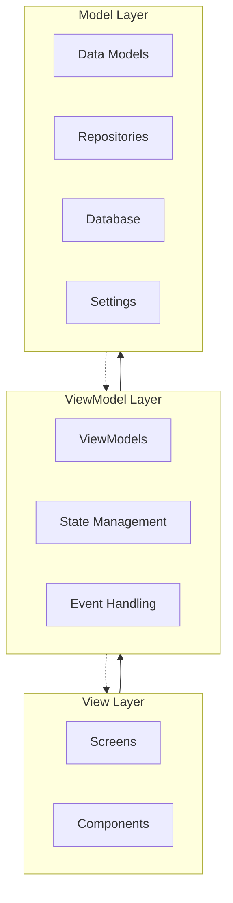
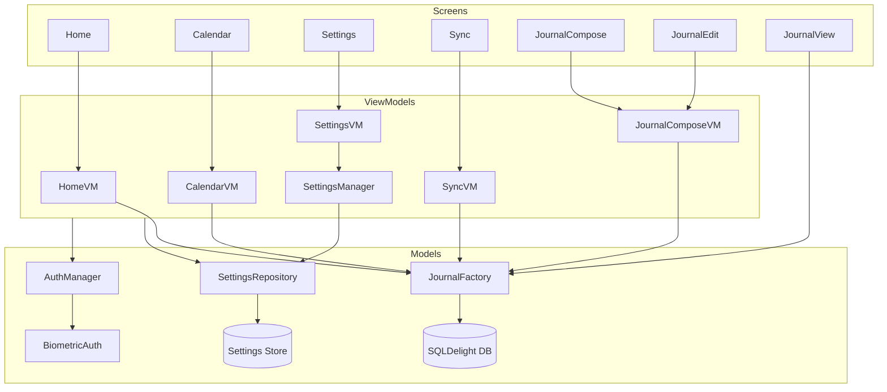

# Zidary - Where privacy meets poetry.

Zidary is a journaling app focused on privacy. There are already tons of journaling app out there but none of them provide a multiplatform sync or export/import functionality while keeping the data encrypted and 100% locally. Zidary is built to fill in that gap. 

Picture this: Your memories, dreams, and deepest thoughts, all protected by strong encryption while floating seamlessly between your devices like whispers in the wind. No corporate giants peering over your shoulder, no data stored in distant servers – just you and your words, dancing together in perfect privacy.

Time-travel through your journey with calendar view, where each day holds the chapters of your story like precious gems in a treasure chest. And because your story deserves to be told in your voice, Zidary lets you dress your words in the perfect typography – whether you're feeling serif elegant or sans-serif bold.

Google's Material 3 design is woven into the fabric of Zidary, creating an interface that shifts between light and dark themes like dawn and dusk. Your eyes will thank you, and your soul will feel at home.

Security isn't just a feature here – it's a necessity for writing your life. Your device's biometric guardian stands watch over your digital diary, while the clever preview-hiding feature keeps curious eyes at bay. Need to share your chronicles across devices? Export your encrypted journal like a message in an unbreakable bottle, ready to be unveiled only by those who hold the key.

So, What are you waiting for? Let's write your life your way!

## Features

### Journal Management
- ✍️ Create, edit, and delete journal entries
- 📅 Set custom date and time for entries
- 🔍 Preview entries in list view

### Calendar Integration
- 📆 Calendar view for entry navigation
- 🎯 Date-based entry filtering
- 📌 Visual indicators for days with entries
- 🗓️ Month and year navigation

### Appearance & Customization
- 🌓 Light/Dark/System theme support
- 🎨 Material You design implementation
- 📝 Multiple font family options

### Privacy & Security
- 🔐 Biometric authentication
- 👀 Entry preview hiding
- 🔒 Local-only data storage
- 🛡️ Encrypted data export/import

### Sync & Backup
- 💾 Encrypted journal export
- 📲 Cross-device sync via file sharing
- 📦 Selective date range export
- 🔄 Journal import with conflict resolution

### Additional Features
- 🔔 Customizable writing reminders
- 📱 Native platform integrations
- ⚡ Offline-first functionality
- 🎯 Intuitive user interface

## Architecture

Zidary follows the MVVM (Model-View-ViewModel) architecture pattern with a clean separation of concerns. The app is structured into three main layers:

### Layer Overview

### Component Details

## Libraries Used

| **Use**                 | **Source**                                                                                                                            |
|-------------------------|---------------------------------------------------------------------------------------------------------------------------------------|
| Navigation              | [Voyager](https://github.com/adrielcafe/voyager)                                                                                      |
| ViewModel               | [moko-mvvm](https://github.com/icerockdev/moko-mvvm)                                                                                  |
| Data Storage            | [Sqldelight](https://github.com/sqldelight/sqldelight), [multiplatform-settings](https://github.com/russhwolf/multiplatform-settings) |
| Dependency Injection    | [Koin](https://github.com/InsertKoinIO/koin)                                                                                          |
| Cryptography            | [cryptography-kotlin](https://github.com/whyoleg/cryptography-kotlin)                                                                 |
| Text Animation          | [Texty](https://github.com/ArjunJadeja/texty)                                                                                         |
| File Handling           | [Filekit](https://github.com/vinceglb/FileKit)                                                                                        |
| Notification Management | [Alarmee](https://github.com/Tweener/alarmee)                                                                                         |
| Permission Management   | [Calf](https://github.com/MohamedRejeb/Calf)                                                                                          |

## Future Roadmap

- [ ] Auto encrypted sync across local devices 
- [ ] Rich text formatting support
- [ ] Custom tags and categories
- [ ] Search functionality
- [ ] Photo attachment support
- [ ] Statistics and insights
